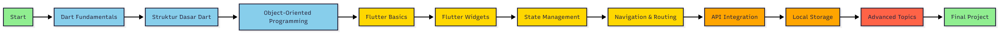

# 📱 Materi Mobile & IoT Computing (MIC)

> Repository pembelajaran Dart dan Flutter untuk Mobile Programming

## 📖 Deskripsi

Repository ini berisi materi pembelajaran lengkap untuk **Dart** dan **Flutter**, dirancang khusus untuk mata kuliah Mobile Development. Materi disusun secara terstruktur dari dasar hingga tingkat lanjut, dilengkapi dengan contoh kode, latihan praktis, dan solusi lengkap.

Setiap modul pembelajaran mencakup:
- 📚 **README.md** - Teori dan penjelasan konsep lengkap
- 💻 **contoh.dart** - Implementasi kode yang dapat dijalankan
- 📝 **latihan.md** - Soal latihan dengan sistem penilaian


## 🎯 Tujuan Pembelajaran

1. Memahami dasar-dasar bahasa pemrograman Dart
2. Menguasai konsep Object-Oriented Programming (OOP)
3. Mampu membangun aplikasi mobile dengan Flutter
4. Mengimplementasikan best practices dalam pengembangan aplikasi
5. Menyelesaikan masalah pemrograman secara efektif

## 🗺️ Roadmap Pembelajaran



```mermaid
graph LR
    A[Start] --> B[Dart Fundamentals]
    B --> C[Struktur Dasar Dart]
    C --> D[Object-Oriented Programming]
    D --> E[Flutter Basics]
    E --> F[Flutter Widgets]
    F --> G[State Management]
    G --> H[Navigation & Routing]
    H --> I[API Integration]
    I --> J[Local Storage]
    J --> K[Advanced Topics]
    K --> L[Final Project]
    
    style A fill:#90EE90
    style B fill:#87CEEB
    style C fill:#87CEEB
    style D fill:#87CEEB
    style E fill:#FFD700
    style F fill:#FFD700
    style G fill:#FFD700
    style H fill:#FFD700
    style I fill:#FFA500
    style J fill:#FFA500
    style K fill:#FF6347
    style L fill:#90EE90
```

### Phase 1: Dart Fundamentals (✅ Available)
**Durasi:** 2-3 Minggu

- ✅ **Modul 1: Struktur Dasar Dart**
  - Variabel dan Tipe Data
  - Operator
  - Control Flow (if-else, switch, loops)
  - Function
  - Collections (List, Set, Map)
  - Null Safety
  
- ✅ **Modul 2: Object-Oriented Programming**
  - Class dan Object
  - Constructor
  - Encapsulation
  - Inheritance
  - Polymorphism
  - Abstraction
  - Interface
  - Mixin
  - Extension Methods

### Phase 2: Flutter Basics (🚧 Coming Soon)
**Durasi:** 3-4 Minggu

- 🔜 **Modul 3: Flutter Introduction**
  - Setup Development Environment
  - Project Structure
  - Widget Tree
  - Hot Reload & Hot Restart
  
- 🔜 **Modul 4: Flutter Widgets**
  - Stateless vs Stateful Widgets
  - Basic Widgets (Text, Container, Column, Row)
  - Material Design Components
  - Layout Widgets
  - Input & Forms

### Phase 3: Intermediate Flutter (🚧 Planned)
**Durasi:** 3-4 Minggu

- 🔜 **Modul 5: State Management**
  - setState
  - Provider
  - Riverpod
  - BLoC Pattern
  
- 🔜 **Modul 6: Navigation & Routing**
  - Navigator 1.0
  - Navigator 2.0
  - Named Routes
  - Passing Data

### Phase 4: Advanced Topics (🚧 Planned)
**Durasi:** 4-5 Minggu

- 🔜 **Modul 7: API Integration**
  - HTTP Requests
  - JSON Parsing
  - REST API
  - Error Handling
  
- 🔜 **Modul 8: Local Storage**
  - SharedPreferences
  - SQLite
  - Hive
  - File Storage
  
- 🔜 **Modul 9: Advanced Features**
  - Animations
  - Custom Widgets
  - Platform Channels
  - Firebase Integration

## 📚 Table of Contents

### 📂 Dart

#### 1️⃣ [Struktur Dasar Dart](./Dart/01-Struktur-Dasar/)
Pengenalan dasar-dasar bahasa Dart untuk pemula.

**Topik:**
- Variabel dan Tipe Data (`int`, `double`, `String`, `bool`)
- Operator (Aritmatika, Perbandingan, Logika)
- Control Flow (`if-else`, `switch`, `for`, `while`)
- Function (Parameter, Return Value, Arrow Function)
- Collections (`List`, `Set`, `Map`)
- Null Safety (`?`, `!`, `??`)

**Latihan:** 12 soal + bonus (200 poin total)
- Grade A: 85%+ | B: 70-84% | C: 60-69% | D: 50-59% | E: <50%

**Files:**
- [`README.md`](./Dart/01-Struktur-Dasar/README.md) - Materi lengkap
- [`contoh.dart`](./Dart/01-Struktur-Dasar/contoh.dart) - Contoh implementasi
- [`latihan.md`](./Dart/01-Struktur-Dasar/latihan.md) - Soal latihan

#### 2️⃣ [Object-Oriented Programming](./Dart/02-OOP/)
Konsep pemrograman berorientasi objek dalam Dart.

**Topik:**
- Class dan Object
- Constructor (Default, Named, Factory)
- Encapsulation (Private Properties, Getter/Setter)
- Inheritance (`extends`, `super`)
- Polymorphism (Method Overriding)
- Abstraction (Abstract Class)
- Interface (`implements`)
- Mixin (`with`)
- Extension Methods

**Latihan:** 12 soal (310 poin total)
- Mencakup real-world scenarios
- Sistem perpustakaan, e-commerce, restoran

**Files:**
- [`README.md`](./Dart/02-OOP/README.md) - Materi lengkap
- [`contoh.dart`](./Dart/02-OOP/contoh.dart) - Contoh implementasi
- [`latihan.md`](./Dart/02-OOP/latihan.md) - Soal latihan

---

### 📱 Flutter

#### 🔜 Coming Soon
Flutter modules akan ditambahkan secara bertahap. Stay tuned!

---

## 🚀 Cara Menggunakan Repository

### Prerequisites
- [Dart SDK](https://dart.dev/get-dart) (versi 3.0+)
- [Flutter SDK](https://flutter.dev/docs/get-started/install) (untuk modul Flutter)
- Code Editor (VS Code, Android Studio, atau IntelliJ IDEA)

### Clone Repository
```bash
git clone https://github.com/Mobile-Programming-MDP/Materi-MIC.git
cd Materi-MIC
```

### Menjalankan Contoh Kode
```bash
# Dart examples
dart run Dart/01-Struktur-Dasar/contoh.dart
dart run Dart/02-OOP/contoh.dart

# Untuk melihat solusi, pindah ke branch solution
git checkout solution
dart run Dart/01-Struktur-Dasar/jawaban.dart
dart run Dart/02-OOP/jawaban.dart
```

### Struktur Branch
- **`main`** - Materi pembelajaran dan latihan (tanpa jawaban)
- **`solution`** - Termasuk file jawaban untuk semua latihan

## 📊 Sistem Penilaian

Setiap modul memiliki sistem penilaian berbasis poin:

| Grade | Persentase | Keterangan |
|-------|-----------|------------|
| **A** | 85% - 100% | Sangat Baik |
| **B** | 70% - 84% | Baik |
| **C** | 60% - 69% | Cukup |
| **D** | 50% - 59% | Kurang |
| **E** | < 50% | Sangat Kurang |

**Tips untuk Grade A:**
- Selesaikan semua soal wajib
- Kerjakan soal bonus
- Implementasikan error handling
- Tulis kode yang clean dan readable
- Tambahkan validasi input

## 🛠️ Best Practices

### Coding Standards
- Gunakan `lowerCamelCase` untuk variabel dan method
- Gunakan `UpperCamelCase` untuk class dan enum
- Gunakan `lowercase_with_underscores` untuk file
- Tambahkan komentar untuk logika kompleks
- Ikuti [Effective Dart](https://dart.dev/guides/language/effective-dart)

### Workflow Belajar
1. 📖 Baca README.md untuk memahami teori
2. 💻 Pelajari contoh.dart untuk melihat implementasi
3. 📝 Kerjakan latihan.md secara mandiri
4. ✅ Bandingkan dengan jawaban.dart (setelah mencoba sendiri)
5. 🔄 Review dan refactor kode Anda

## 📖 Referensi & Resources

### Official Documentation
- [Dart Language Tour](https://dart.dev/guides/language/language-tour)
- [Dart API Reference](https://api.dart.dev/)
- [Flutter Documentation](https://flutter.dev/docs)
- [Flutter Widget Catalog](https://flutter.dev/docs/development/ui/widgets)

### Learning Resources
- [Dart Pad](https://dartpad.dev/) - Online Dart editor
- [Flutter Codelabs](https://flutter.dev/docs/codelabs)
- [Dart Packages](https://pub.dev/)

### Community
- [Dart Discord](https://discord.gg/Qt6DgfAWWx)
- [Flutter Discord](https://discord.gg/rflutterdev)
- [Stack Overflow - Dart](https://stackoverflow.com/questions/tagged/dart)
- [Stack Overflow - Flutter](https://stackoverflow.com/questions/tagged/flutter)

## 🤝 Kontribusi

Repository ini dikembangkan untuk keperluan pembelajaran. Jika menemukan kesalahan atau ingin menambahkan materi:

1. Fork repository ini
2. Buat branch baru (`git checkout -b feature/new-module`)
3. Commit perubahan (`git commit -m 'Add new module'`)
4. Push ke branch (`git push origin feature/new-module`)
5. Buat Pull Request

## 📝 Lisensi

Repository ini dibuat untuk keperluan edukasi di lingkungan Mobile-Programming-MDP.

## 🔄 Update Log

| Tanggal | Versi | Update |
|---------|-------|--------|
| 2025-11-25 | 1.0 | Initial release dengan Dart fundamentals (Modul 1 & 2) |

---

<div align="center">

**Happy Coding! 🚀**

Made with ❤️ by Mobile Programming MDP

[⬆ Back to Top](#-materi-mobile--iot-computing-mic)

</div>
